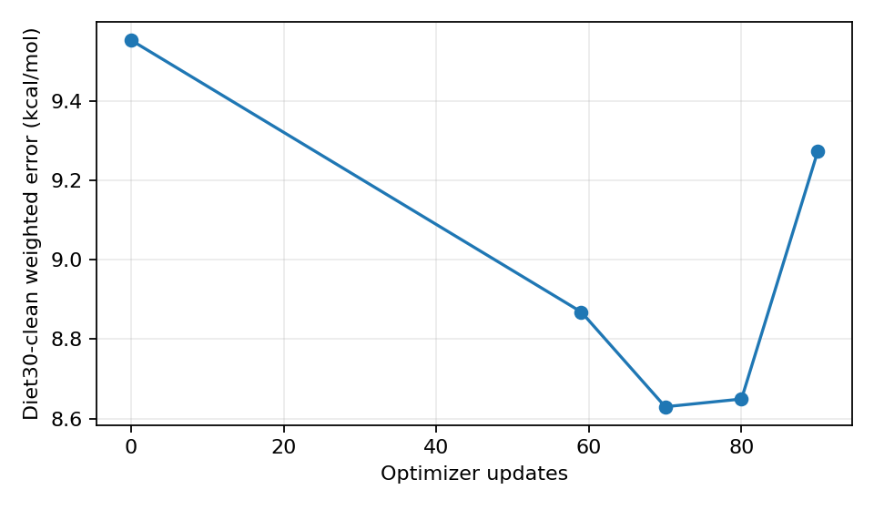

# Preserved IID AdamW continuation: t59 to t90

Exactly 31 additional native AdamW updates completed. Original t59 was copied byte-for-byte, not reconstructed, and remains unchanged. Constant LR=1e-4, betas=(0.9,0.999), eps=1e-8, weight_decay=0.01; no scheduler or task-weight change.

## Clean validation

Clean28 is the Diet30-clean weighted error, mean of 28 Diet-weighted absolute reaction errors (kcal/mol), not canonical full30 WTMAD-2. Same frozen PBE0 densities and PBE0-D3(BJ); no SCF. Full30 is diagnostic, selection_allowed=false.

| Cursor | Clean28 | Change vs t0 | Change vs t59 | Improved / worse vs t0 | Improved / worse vs t59 |
|---|---:|---:|---:|---:|---:|
| 0 | 9.553190636 | +0.000000000 | +0.684717309 | 0 / 0 | 7 / 21 |
| 59 | 8.868473327 | -0.684717309 | +0.000000000 | 21 / 7 | 0 / 0 |
| 70 | 8.629660230 | -0.923530406 | -0.238813097 | 19 / 9 | 18 / 10 |
| 80 | 8.649173724 | -0.904016912 | -0.219299603 | 20 / 8 | 19 / 9 |
| 90 | 9.273578777 | -0.279611859 | +0.405105450 | 17 / 11 | 6 / 22 |

Minimum measured Clean28 occurs at t70, 0.923530406 kcal/mol below P536. Consecutive improvements occur at t0->t59->t70; there are not two successive improvements after t59. t80 stays near t70, then t90 rebounds. Thus t59 is part of a favorable early window, not proof of sustained convergence. Only t59/t90 have the requested exact scientific audit; t70 is numerically finite but scientific eligibility is unverified.

## Exact scientific objectives

Same independent fixed manifest: 251 relchem + 17 AE17 identities, exactly one variant per identity; all90 mRKS systems, equal-system means, no parameter backward. Initial receipts reused after exact model-tensor and manifest/protocol checks.

| Task | t0 | t59 | t90 | t59/t0 | t90/t0 |
|---|---:|---:|---:|---:|---:|
| relchem | 1.23547109789 | 1.25201555094 | 1.26792480815 | 1.013391210 | 1.026268288 |
| ae17 | 24.901047104 | 6.47528156881 | 15.3541356673 | 0.260040533 | 0.616606025 |
| exc | 92.17480502 | 25.8876550994 | 51.0584924616 | 0.280853918 | 0.553931114 |
| op | 0.0331482168161 | 0.0320806815029 | 0.031142655452 | 0.967795091 | 0.939497157 |

Neither audited checkpoint is scientifically eligible: exact relchem is above t0. Clean28 improvement must not be confused with relchem-objective improvement. From t59 to t90 both chemistry losses deteriorate; the complete Exc/operator comparison is in the table. These associations do not isolate a causal objective or establish numerical instability.

## Paired reaction diagnostics

All 28 clean signed/absolute errors, predictions, references, weights and exact score contributions at every checkpoint are in the JSON; contributions sum to the reported Clean28 within 1e-12. Repeated checkpoints on one validation panel are correlated, not independent replications.

| Largest t70 improvements vs t0 | Score-contribution change |
|---|---:|
| HEAVY28-16 | -0.157883388 |
| BHPERI-11 | -0.133500838 |
| BUT14DIOL-13 | -0.124872426 |
| PX13-9 | -0.102527803 |
| HAL59-40 | -0.098582571 |
| S66-6 | -0.098546558 |
| HAL59-57 | -0.079056207 |
| Amino20x4-54 | -0.072435993 |

| Largest t90 deterioration vs t70 | Score-contribution change |
|---|---:|
| BUT14DIOL-13 | +0.079642066 |
| Amino20x4-28 | +0.078672743 |
| S66-6 | +0.066218766 |
| BHROT27-16 | +0.063956713 |
| HEAVY28-16 | +0.061288875 |
| WCPT18-15 | +0.044934608 |
| Amino20x4-54 | +0.044573913 |
| G21EA-14 | +0.043832886 |

t70 improves 19/28 reactions vs t0; its three largest improvements explain about 45% of the net gain, so the result is broad but concentrated. t90 worsens 22/28 vs t59. No checkpoint is promoted from a single reaction.

## Runtime and provenance

Logged synchronized update time: 475.827s (7.93min), 15.349s/update, excluding preflight/checkpoint overhead. Peak live/reserved CUDA memory: 13.119/27.328 GiB on RTX5070Ti. Reserved memory is allocator accounting, not live allocation. Timing includes concurrent focused CPU tests; it is not an isolated hardware benchmark.

Sampling coverage over the 90 actual updates: {'relchem_unique': 78, 'ae17_unique': 17, 'mrks_unique': 90}. All original 59 log entries and samples remain identical; all native moment steps match each checkpoint cursor, RNG is present, model/moment arrays are finite, and the SHA chain is continuous.

| Logged update component | Seconds over 31 updates |
|---|---:|
| chemistry_loading_transfers | 7.750 |
| relchem | 75.432 |
| ae17 | 10.603 |
| mrks_loading_transfers | 28.583 |
| exc | 60.031 |
| op | 292.652 |
| weighted_aggregation_adamw | 0.419 |

Dataset logical SHA256: `61c221a19b9987717e69cac182ad545241f8807db4126c0949a99992e4c210ef`.

| Cursor | Checkpoint SHA256 |
|---|---|
| 59 | `8938753bee6cfcb55ccdac9c02a15cbb3e3b2093290c9122e5e00ad400a966aa` |
| 70 | `04b8e549c17375988be576e2878881d13f55b217b42ec16a7e6101fdddd05443` |
| 80 | `f2b3eb72be776e159824d770af1a917222a75c6af49c64911b0c111e5dcc678a` |
| 90 | `4bc5a84aeea8653fdae2121d440e979376fffd7052f3b8713b0bdfd3e4103e7a` |

Large checkpoints and the full SHA-bound checkpoint/configuration manifest: `C:\Dev\readWFN_share_ms\lap_iid_adamw_t59_t90_20261009`. Physics source, evaluator, sampling, coefficient and endpoint receipts are recorded in the metrics; no production source changed.

## Decision

**NO-GO for automatic continuation or production promotion.** t90 reverses much of the validation gain and fails relchem eligibility. Preserve t59/t70/t80/t90. The exact next bounded experiment is a read-only four-objective audit of preserved t70 on the same fixed one-variant/full90 panel, before choosing a scientifically eligible early checkpoint. Do not launch it as part of this continuation.

Independent sampling-seed confirmation is justified before committing 2xV100 resources, conditionally on that scientific gate. A longer unchanged t90 run is not supported. LR=1e-4 produced a useful early validation window but is not established as a robust long-horizon setting. No LR/weight mechanism is identified causally by this single trajectory.

For eventual two-V100 use, independent replicas are the appropriate first confirmation. The measured Exc/full-AO workloads dominate updates; no actual dual-V100 speedup was measured. Distributed optimization would require a globally normalized gradient for each task and the same fixed coefficients before one shared AdamW update; independent per-GPU scalarizations or silently doubled chemistry batch size would change the protocol. No Slurm submission.

Validation: 17 focused tests passed (including real native AdamW deterministic resume and wrapper no-replay/original-preservation tests); Ruff, compileall and git diff --check passed. Ponytail: existing trainer/evaluator reused, no new optimizer or objective machinery. Pocock: original SHA, moments, cursor, RNG, parameter order, source hashes, fixed variants, sample identity and exact score reconstruction checked; unknown t70 scientific eligibility and correlated validation points are explicit.

No future-test evaluation, SCF, architecture/precision/dataset changes, historical reruns or updates beyond t90 occurred.
